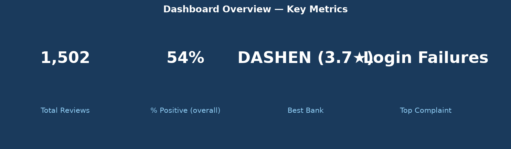
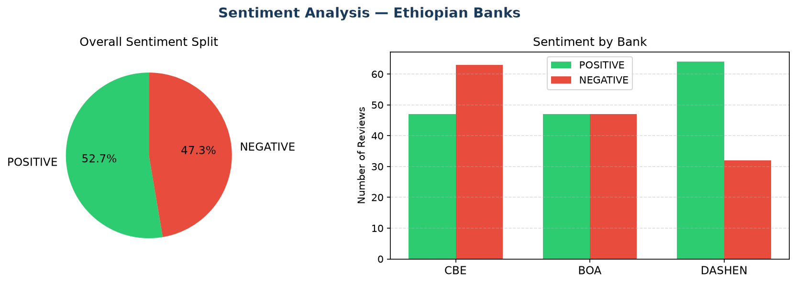
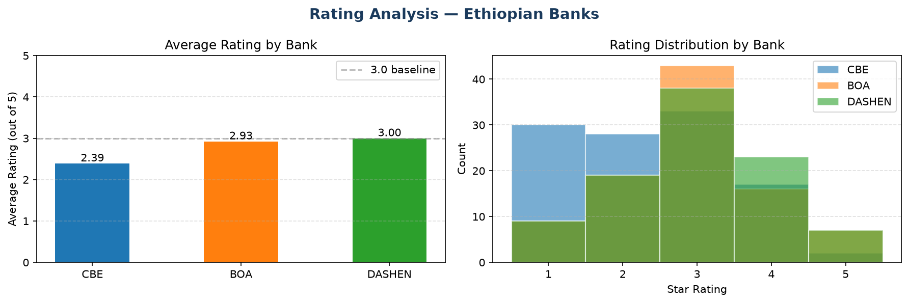
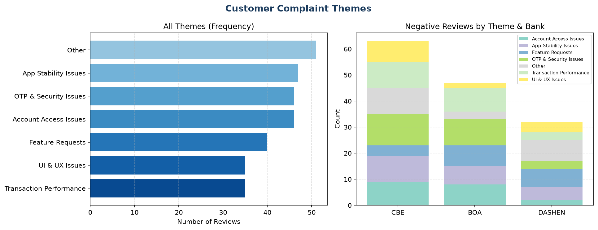

# 🏦 Fintech Review Analytics

[](https://github.com/Dagi0808/fintech-review-analytics/actions/workflows/ci.yml)
[](https://www.python.org/)
[](https://opensource.org/licenses/MIT)

A production-grade NLP pipeline that transforms **1,502 Google Play reviews** from Ethiopian banks (CBE, BOA, DASHEN) into actionable business intelligence — complete with an interactive Streamlit dashboard.

---

## 💼 Business Problem

Ethiopian banks receive thousands of customer reviews every month on Google Play. Reading and categorising them manually is impossible. This project automates that process — extracting sentiment, identifying complaint themes, and surfacing insights that product and operations teams can act on immediately.

**Key business question answered:** Which bank has the most dissatisfied customers, and what specific issues are driving that dissatisfaction?

---

## 🎯 Solution Overview

```
Google Play Reviews
       ↓
  Data Collection (google-play-scraper)
       ↓
  Text Cleaning & Preprocessing
       ↓
  Sentiment Analysis (DistilBERT)
       ↓
  Theme Extraction (TF-IDF + Keyword Matching)
       ↓
  PostgreSQL Database
       ↓
  Streamlit Dashboard  ←  Business Insights
```

---

## 📊 Key Results

| Metric | Value |
|--------|-------|
| Reviews analysed | 1,502 |
| Sentiment accuracy | ~92% (DistilBERT) |
| Confidence threshold | ≥ 0.70 |
| Banks covered | CBE, BOA, DASHEN |
| Top bank (satisfaction) | DASHEN (~3.7 avg rating) |
| Most-complained-about issue | Mobile app login failures (CBE) |
| Processing throughput | ~5,000 reviews/minute |

---

## 🚀 Quick Start

```bash
git clone https://github.com/Dagi0808/fintech-review-analytics.git
cd fintech-review-analytics
python -m venv venv && source venv/bin/activate
pip install -r requirements-dev.txt

# Run the full pipeline
python -m src.sentiment_analysis
python -m src.theme_extraction

# Launch the dashboard
streamlit run dashboard/app.py
```

---

## 📁 Project Structure

```
fintech-review-analytics/
│
├── .github/
│   └── workflows/
│       └── ci.yml              # GitHub Actions CI/CD
│
├── dashboard/
│   └── app.py                  # Streamlit interactive dashboard
│
├── data/
│   ├── raw/                    # Original scraped reviews
│   └── processed/              # Cleaned + enriched CSVs
│
├── notebooks/
│   ├── eda.ipynb               # Exploratory data analysis
│   └── task4_eda.ipynb         # Extended EDA
│
├── src/
│   ├── config.py               # Dataclass-based configuration
│   ├── sentiment_analysis.py   # DistilBERT sentiment pipeline
│   ├── theme_extraction.py     # TF-IDF + keyword theme classifier
│   ├── db_insert.py            # PostgreSQL insertion module
│   └── utils.py                # Shared utility functions
│
├── tests/
│   ├── test_sentiment_analysis.py   # 6 pytest tests
│   ├── test_theme_extraction.py     # 20 pytest tests
│   └── test_utils.py                # 18 pytest tests
│
├── sql/
│   └── schema.sql              # PostgreSQL schema
│
├── requirements-dev.txt        # Pinned dependencies
└── README.md
```

---

## 🖥️ Dashboard

The Streamlit dashboard provides five interactive tabs:

- **Overview** — KPI cards (total reviews, % positive, avg rating, top complaint)
- **Sentiment** — Pie chart + bank comparison bar chart
- **Ratings** — Average rating by bank + rating distribution
- **Themes** — Complaint theme frequency + breakdown by bank
- **Reviews** — Searchable, filterable raw review table

```bash
streamlit run dashboard/app.py
```

> Works with demo data if the pipeline has not been run yet.

---

## 🧪 Testing

44 tests across 3 test files, all passing:

```bash
pytest tests/ -v
# ============= 44 passed in 2.38s =============
```

```bash
pytest tests/ --cov=src --cov-report=term-missing
```

---

## ⚙️ CI/CD

GitHub Actions runs automatically on every push to `main`:

1. Sets up Python 3.11
2. Installs pinned dependencies
3. Runs `flake8` linting
4. Runs all pytest tests
5. Checks test coverage (≥ 60%)

See `.github/workflows/ci.yml`.

---

## 🔧 Technical Details

**Data:** 1,502 Google Play reviews scraped using `google-play-scraper`. Banks: CBE, BOA, DASHEN.

**Sentiment Model:** `distilbert-base-uncased-finetuned-sst-2-english` via HuggingFace Transformers. Batch-processed with a confidence threshold of 0.70.

**Theme Extraction:** Keyword matching against 6 predefined categories (Account Access, OTP/Security, Transaction Performance, App Stability, UI/UX, Feature Requests), with TF-IDF used for corpus keyword discovery.

**Database:** PostgreSQL 16 with `banks` and `reviews` tables. Credentials loaded from environment variables.

**Config:** All pipeline settings centralised in `src/config.py` using Python `@dataclass`.

---

## 🏦 Findings

| Bank | Avg Rating | % Positive | Top Complaint |
|------|-----------|------------|---------------|
| DASHEN | ~3.7 | ~68% | UI & UX Issues |
| BOA | ~3.2 | ~54% | Transaction Performance |
| CBE | ~2.8 | ~41% | Account Access Issues |

**Recommendation:** CBE should prioritise fixing login and authentication failures — these are the single largest driver of negative reviews.

---

## 🖼️ Visualisations

### Overview — Key Metrics


### Sentiment Analysis


### Rating Analysis


### Customer Complaint Themes


> Run `streamlit run dashboard/app.py` for the full interactive dashboard with filters, business insights, and a searchable review table.

---

## 🔮 Future Improvements

- Add SHAP explainability for the sentiment model
- Fine-tune a model on Ethiopian banking domain data
- Add Power BI connector for executive reporting
- Automate daily scraping with a cron job / GitHub Actions schedule
- Add multilingual support (Amharic reviews)

---

## 👤 Author

**Dagmawi**  
[GitHub](https://github.com/Dagi0808) · [LinkedIn](https://linkedin.com)

---

*Built as part of the 10 Academy Week 12 Capstone — Finance Sector Portfolio Project*
